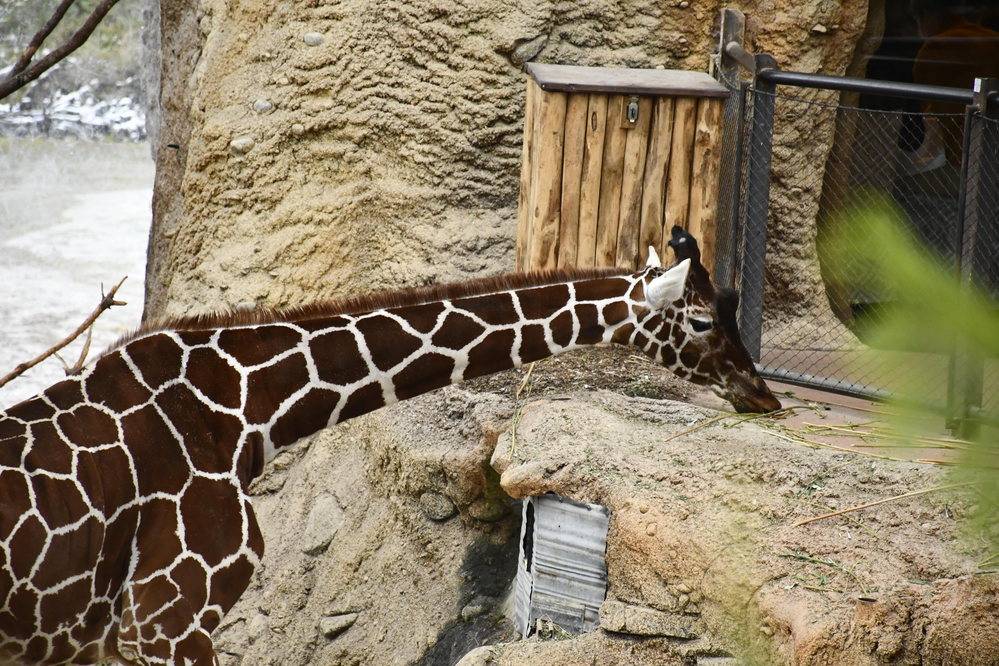

# Die Cevi Programme finden draussen im Wald statt.

## Cevi Züri 11.

Im Cevi Züri 11 erlebst du jeden Samstag von 14:00 bis 17:00 Uhr ein spannendes Programm draussen in der Natur. Für alle
Kinder und Jugendlichen bieten wir eine abwechslungsreiche und sinnvolle Freizeitbeschäftigung voller Sport, Spass und
Action.

<button>Cevianer werden!</button>

Dadurch, dass die Kinder im Cevi genau einmal die Gruppe wechseln, nämlich von den Fröschli zu den Grossen. Bieten wir
ihnen die einmalige Gelegenheit, ihre komplette Kindheit und Jugend mit denselben Bezugspersonen (Leitern) zu
verbringen. Wir schaffen somit eine emotionale und persönliche Bindung, die keine andere Institution (Sportverein,
Schule usw.) bieten kann.

Nicht selten entstanden aus dem Cevi Beziehungen und Freundschaften, die ein Leben lang halten. So gibt es immer wieder
Leiter aus Stufen des Cevi Züri 11, die auch gemeinsam in die Ferien fahren oder gar zusammen in eine WG ziehen.

Wir versuchen den Kindern die Möglichkeit zu bieten, sich in unseren Programmen frei von Leistungsdruck zu entwickeln,
auszutoben und zu entfalten. In diesem Punkt unterscheidet sich der Cevi deutlich von anderen Sport- und
Freizeitvereinen, bei uns gibt es kein ständiger Leistungsdruck, keine Qualifikationen und kein Druck in eine höhere
Liga aufzusteigen. Die Kinder dürfen bei uns Kinder bleiben!